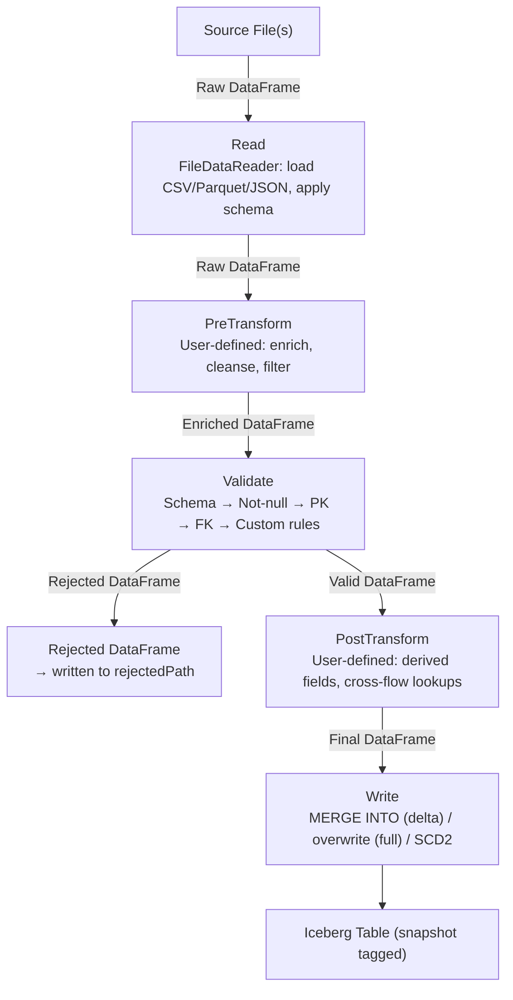

# Data Flow

Detailed walkthrough of the Read → PreTransform → Validate → PostTransform → Write pipeline. This page describes what happens at each step when a flow is executed.

## Pipeline overview

## Step 1: Read

The `DataReaderFactory` creates a `FileDataReader` based on the flow's `source` config. The reader:

1. Validates the file format (csv, parquet, json)
2. Optionally applies the schema from `schema.columns` if `enforceSchema: true`
3. Applies format-specific options (header, delimiter, etc.)
4. Calls `spark.read.format(...).options(...).load(path)`

The result is a raw DataFrame with the source data.

See [Data Sources](../guides/data-sources.md).

## Step 2: PreTransform

If a pre-validation transformation is registered for this flow, it runs now. The transformation receives a `TransformationContext` with:

- `currentData` — the raw DataFrame from step 1
- `validatedFlows` — empty map (no flows validated yet at this stage)
- `batchId`, `currentFlow`, `spark` — metadata

The transformation returns a new context with modified data via `ctx.withData(...)`.

Common operations: adding computed columns, normalizing formats, filtering known-bad records, joining with external reference data.

See [Pipeline Builder — Transformations](../guides/pipeline-builder.md#transformations).

## Step 3: Validate

The validation engine runs a fixed sequence of checks on the enriched DataFrame:

### 3a. Schema validation

If `enforceSchema: true`:

- Checks all declared columns are present → `SCHEMA_VALIDATION_FAILED` (entire DataFrame rejected)
- If `allowExtraColumns: false`, checks for undeclared columns → `SCHEMA_EXTRA_COLUMNS`

### 3b. Not-null validation

For each column with `nullable: false`, rejects rows where the column is NULL → `NOT_NULL_VIOLATION`.

### 3c. Primary key uniqueness

Groups by PK columns, finds duplicates. All rows sharing a duplicated key are rejected → `PK_DUPLICATE`.

### 3d. Foreign key integrity

For each FK, checks that values exist in the referenced parent flow's DataFrame (broadcast join). NULL FK values pass. → `FK_VIOLATION`.

### 3e. Custom rules

Processes rules in order. Each rule is dispatched to its validator (regex, range, domain, custom class). Based on `onFailure`:

- `reject` — record moves to rejected DataFrame
- `warn` — record stays valid, warning record written to separate Parquet file at `{rejectedPath}/{flowName}_warnings/`
- `skip` — rule not executed

### Output

The validation step produces:

- **Valid DataFrame** — clean records with business columns only
- **Rejected DataFrame** — records with `_rejection_code`, `_rejection_reason`, `_validation_step`, `_rejected_at`
- **Warning DataFrame** — records with PK columns + `_warning_rule`, `_warning_message`, `_warning_column`, `_warned_at`, `_batch_id` (written to separate Parquet)
- **Rejection reasons** — `Map[String, Long]` counting rejections per step

Rejected records are written to the flow's `rejectedPath`.

See [Validation Engine](../guides/validation.md).

## Step 4: PostTransform

If a post-validation transformation is registered, it runs on the valid records only. The `TransformationContext` now has:

- `currentData` — the valid DataFrame from step 3
- `validatedFlows` — populated with all flows validated so far in this batch

Common operations: computing derived fields, cross-flow lookups via `ctx.getFlow()`, creating additional tables via `ctx.addTable()`.

## Step 5: Write

The `IcebergTableWriter` selects the write strategy based on `loadMode.type`:

### Full load

`writeTo().overwrite(lit(true))` — atomically replaces all existing rows regardless of partitioning. Even an empty source clears the table. Previous data remains accessible via time travel until snapshot expiration.

### Delta (upsert)

Single `MERGE INTO` with value-based change detection using null-safe `<=>` operator. Unchanged rows are skipped. New rows are inserted.

### SCD2

Single atomic `MERGE INTO` using the NULL merge-key trick:

1. Modified records appear twice in the staging view (real PK + NULL PK)
2. Clause 1: closes old version (`is_current = false`)
3. Clause 2: inserts new version (`is_current = true`)
4. Clause 3 (optional): soft-deletes absent records

After writing, the snapshot is tagged with the batch ID if `enableSnapshotTagging: true`.

See [Iceberg Integration](../guides/iceberg.md) and [SCD2 Guide](../guides/scd2.md).

## Post-batch operations

After all flows complete:

1. **Orphan detection** — uses time travel to find removed parent keys, resolves orphaned children. See [Orphan Detection](../guides/orphan-detection.md).
2. **Batch metadata write** — JSON with Iceberg snapshot details and orphan reports.
3. **Table maintenance** — snapshot expiration, compaction, orphan cleanup, manifest rewrite.

## Related

- [Architecture Overview](overview.md) — module diagram
- [Execution Model](execution-model.md) — flow ordering and parallelism
- [Pipeline Builder](../guides/pipeline-builder.md) — builder API
