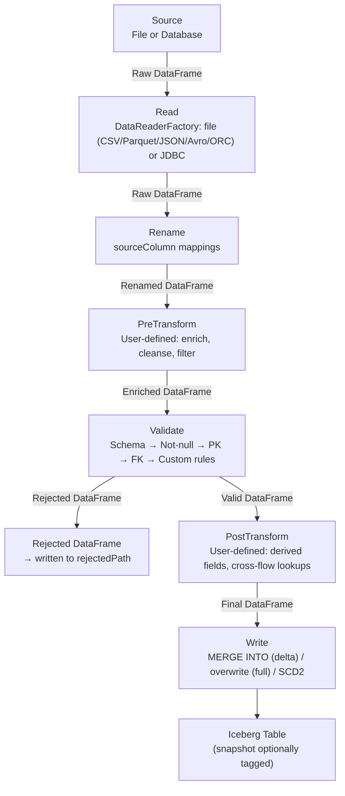

# Data Flow

Detailed walkthrough of the Read → PreTransform → Validate → PostTransform → Write pipeline. This page describes what happens at each step when a flow is executed.

## Pipeline overview

```mermaid
graph TD
    Source["Source<br/>File or Database"]
    Read["Read<br/>DataReaderFactory: file (CSV/Parquet/JSON/Avro/ORC) or JDBC"]
    Rename["Rename<br/>sourceColumn mappings"]
    PreTransform["PreTransform<br/>User-defined: enrich, cleanse, filter"]
    Validate["Validate<br/>Schema → Not-null → PK → FK → Custom rules"]
    Rejected["Rejected DataFrame<br/>→ written to rejectedPath"]
    PostTransform["PostTransform<br/>User-defined: derived fields, cross-flow lookups"]
    Write["Write<br/>MERGE INTO (delta) / overwrite (full) / SCD2"]
    IcebergTable["Iceberg Table<br/>(snapshot optionally tagged)"]

    Source -->|"Raw DataFrame"| Read
    Read -->|"Raw DataFrame"| Rename
    Rename -->|"Renamed DataFrame"| PreTransform
    PreTransform -->|"Enriched DataFrame"| Validate
    Validate -->|"Valid DataFrame"| PostTransform
    Validate -->|"Rejected DataFrame"| Rejected
    PostTransform -->|"Final DataFrame"| Write
    Write --> IcebergTable
```

## Step 1: Read

The `DataReaderFactory` creates a reader based on the flow's `source.type` config:

- **File** (`FileDataReader`): validates CSV, Parquet, JSON, Avro, or ORC, optionally applies the schema, and loads from the configured path.
- **JDBC** (`JDBCDataReader`): connects through a JDBC URL and reads a table or wrapped query. Spark connector options are passed through, while Floe-owned keys such as `replayToken` are removed.
- **Custom**: a factory registered with `withDataReader` handles any other `source.type`.

The result is a raw DataFrame with the source data.

### Column renames

If any column in the schema config has a `sourceColumn` field, the framework renames those columns before validation. This allows the source to use different column names than the target schema.

See [Data Sources](../guides/data-sources.md).

## Step 2: PreTransform

If a pre-validation transformation is registered for this flow, it runs now. The transformation receives a `TransformationContext` with:

- `currentData` — the DataFrame after column renames from step 1
- `validatedFlows` — empty map (no flows validated yet at this stage)
- `batchId`, `currentFlow`, `spark` — metadata

The transformation returns a new context with modified data via `ctx.withData(...)`.

Common operations: adding computed columns, normalizing formats, filtering known-bad records, joining with external reference data.

See [Pipeline Builder — Transformations](../guides/pipeline-builder.md#transformations).

## Step 3: Validate

The validation engine runs a fixed sequence of checks on the enriched DataFrame:

### 3a. Schema validation

If `enforceSchema: true`:

- Checks all declared columns are present → `SCHEMA_VALIDATION_FAILED` (entire DataFrame rejected)
- If `allowExtraColumns: false`, checks for undeclared columns → `SCHEMA_EXTRA_COLUMNS`

### 3b. Not-null validation

For each column with `nullable: false`, rejects rows where the column is NULL → `NOT_NULL_VIOLATION`.

### 3c. Primary key uniqueness

Groups by PK columns, finds duplicates. All rows sharing a duplicated key are rejected → `PK_DUPLICATE`. Skipped if `primaryKey` is empty (e.g. full load without a natural key).

### 3d. Foreign key integrity

For each FK, checks that values exist in the referenced parent flow's DataFrame. NULL FK values pass. → `FK_VIOLATION`.

### 3e. Custom rules

Processes rules in order. Each rule is dispatched to its validator (regex, range, domain, custom class). Based on `onFailure`:

- `reject` — record moves to rejected DataFrame
- `warn` — record stays valid, warning record written to separate Parquet file at `{warningsPath}/{flowName}/`
- `skip` — rule not executed

### Output

The validation step produces:

- **Valid DataFrame** — clean records with business columns only
- **Rejected DataFrame** — records with `_rejection_code`, `_rejection_reason`, `_validation_step`, `_rejected_at`
- **Warning DataFrame** — records with PK columns + `_warning_rule`, `_warning_message`, `_warning_column`, `_warned_at`, `_batch_id` (written to separate Parquet)
- **Rejection reasons** — `Map[String, Long]` counting rejections per step

Rejected records are written to the flow's `rejectedPath`.

See [Validation Engine](../guides/validation.md).

## Step 4: PostTransform

If a post-validation transformation is registered, it runs on the valid records only. The `TransformationContext` now has:

- `currentData` — the valid DataFrame from step 3
- `validatedFlows` — populated with all flows validated so far in this batch

Common operations: computing derived fields, cross-flow lookups via `ctx.getFlow()`.

## Step 5: Write

The `IcebergTableWriter` selects the write strategy based on `loadMode.type`:

### Full load

`writeTo().overwrite(lit(true))` — atomically replaces all existing rows regardless of partitioning. Even an empty source clears the table. Previous data remains accessible via time travel until snapshot expiration.

### Delta (upsert)

Single `MERGE INTO` with value-based change detection using null-safe `<=>` operator. Unchanged rows are skipped. New rows are inserted.

### SCD2

Single atomic `MERGE INTO` using the NULL merge-key trick:

1. Modified records appear twice in the staging view (real PK + NULL PK)
2. Clause 1: closes old version (`is_current = false`)
3. Clause 2: inserts new version (`is_current = true`)
4. Clause 3 (optional): soft-deletes absent records

After writing, the snapshot is tagged with the batch ID if `enableSnapshotTagging: true`.

See [Iceberg Integration](../guides/iceberg.md) and [SCD2 Guide](../guides/scd2.md).

## Publication and post-batch operations

After all flows complete:

1. **Orphan detection** — uses time travel to find removed parent keys, resolves orphaned children. See [Orphan Detection](../guides/orphan-detection.md).
2. **Derived tables** — computes registered outputs from the complete current state of their Iceberg inputs.
3. **Maintenance enqueue** — persists one asynchronous task per managed table. Workers ignore it until the run is published.
4. **Diagnostic outputs** — writes per-flow JSON, the batch summary, and optional quality metrics. These aid operations but do not replace `RunStore` or Iceberg history as authoritative state.
5. **Release publication** — stores the manifest and final run status only after all required work succeeds. The manifest records a pinned snapshot where one exists, or an explicit empty state for a target with no snapshot. An `onOrphan: delete` cleanup commit is a documented current exception; it is not yet a separately pinned operation.

A separate `MaintenanceWorker` later claims queued tasks and runs snapshot expiration, compaction, orphan-file cleanup, and optional manifest rewriting. See [Recovery and Production Operations](../guides/recovery.md).

## Related

- [Architecture Overview](overview.md) — module diagram
- [Execution Model](execution-model.md) — flow ordering and parallelism
- [Pipeline Builder](../guides/pipeline-builder.md) — builder API
