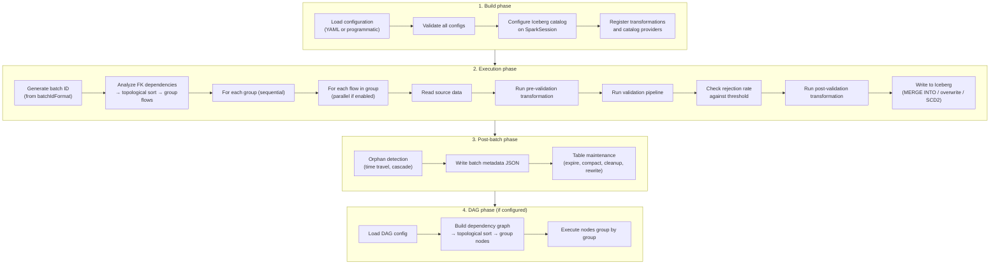

# Execution Model

How flows are ordered, executed in parallel, and how the batch lifecycle works.

## Flow ordering from FK dependencies

Flows are not executed in the order they appear in YAML files. The framework builds an execution plan based on foreign key dependencies:

1. **Dependency analysis** — FK references between flows are extracted. If `orders` has a FK referencing `customers.customer_id`, then `customers` is a dependency of `orders`.

2. **Topological sort** — flows are sorted so that every parent executes before its children. If a circular dependency is detected, a `CircularDependencyException` is thrown with the full cycle path.

3. **Grouping** — flows at the same level (no dependency between them) are grouped together. Each group can potentially execute in parallel.

Example with three flows:

```
customers (no FK)          ← Group 1
orders (FK → customers)    ← Group 2
order_items (FK → orders)  ← Group 3
```

If `products` has no FK to any other flow, it joins Group 1:

```
Group 1: customers, products  (independent, can run in parallel)
Group 2: orders               (depends on customers)
Group 3: order_items          (depends on orders)
```

## Parallel execution

### Flow parallelism

When `performance.parallelFlows` is `true` in `global.yaml`, independent flows within the same group run concurrently:

```yaml
performance:
  parallelFlows: true
```

The thread pool is explicitly sized — the framework does **not** use `ExecutionContext.Implicits.global`. This prevents unbounded parallelism from saturating the Spark driver.

Groups execute sequentially: Group 2 starts only after all flows in Group 1 complete. Within a group, flows run in parallel.

If `parallelFlows` is `false`, all flows execute sequentially in topological order.

### DAG node parallelism

When `parallelNodes` is `true` in the DAG YAML, independent DAG nodes within the same execution group run concurrently:

```yaml
# In the DAG YAML file
parallelNodes: true
```

The thread pool is sized at `availableProcessors * 2`.

If `parallelNodes` is `false` (default), all DAG nodes execute sequentially regardless of independence.

### Thread pool management

Both flow and DAG parallelism use bounded, explicitly sized thread pools:

- Flow parallelism: pool sized at `Runtime.getRuntime.availableProcessors * 2`
- DAG parallelism: pool sized at `Runtime.getRuntime.availableProcessors * 2`

This follows the Spark best practice of never using the global execution context for parallel Spark operations. Each thread submits Spark jobs independently, and Spark's internal scheduler handles resource allocation.

## Batch lifecycle

A complete batch execution follows this sequence:



### Batch ID

The batch ID is generated from `processing.batchIdFormat` using Java's `DateTimeFormatter`:

```yaml
processing:
  batchIdFormat: "yyyyMMdd_HHmmss"
```

Example: `20260328_150000`. The batch ID is used for:

- Snapshot tagging (`batch_20260328_150000`)
- Metadata directory naming (`{metadataPath}/20260328_150000/`)
- Logging and tracing

### Failure handling

- **Flow failure**: if a flow fails, the batch stops. The failed flow is reported in `IngestionResult`.
- **Rejection threshold**: if `maxRejectionRate` is configured (globally or per-flow) and any flow's rejection rate exceeds the threshold, the batch stops. Remaining flows in the current group are not executed.
- **Post-batch failure**: orphan detection and maintenance failures do not affect the batch result. The batch reports SUCCESS if all flow writes completed.
- **Iceberg atomicity**: if a write fails mid-way, Iceberg rolls back automatically. The table remains in the previous state.

## Related

- [Architecture Overview](overview.md) — module diagram
- [Data Flow](data-flow.md) — step-by-step pipeline
- [Global Configuration — performance](../configuration/global.md#performance) — parallelism settings
- [DAG Aggregation](../guides/dag-aggregation.md) — DAG execution details
- [Orphan Detection](../guides/orphan-detection.md) — post-batch FK integrity
- [Batch Listeners](../guides/batch-listeners.md) — notifications on batch completion/failure
- [Quality Metrics](../guides/quality-metrics.md) — per-flow metrics Iceberg table
