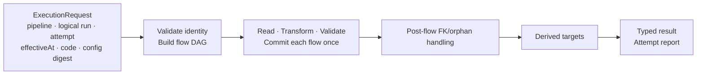

# Execution Model

## Planning and ordering

Floe builds one in-process DAG from foreign-key references and explicit `dependsOn` declarations. It validates references, rejects cycles, topologically sorts flows, and groups independent flows.

```
Group 1: customers, products
Group 2: orders            (depends on customers)
Group 3: order_items       (depends on orders)
```

Groups execute in order. With `performance.parallelFlows: true`, flows in the same group run concurrently on a bounded execution context; otherwise they run sequentially. Floe does not distribute individual flows as external Airflow/Step Functions tasks and cannot resume at an arbitrary group after the driver exits.

## One immutable attempt

The platform submits an `ExecutionRequest` containing stable logical identity and a unique physical attempt:


```mermaid
flowchart LR
    REQUEST["ExecutionRequest<br/>pipeline · logical run · attempt<br/>effectiveAt · code · config digest"]
    PLAN["Validate identity<br/>Build flow DAG"]
    FLOWS["Read · Transform · Validate<br/>Commit each flow once"]
    FK["Post-flow FK/orphan handling"]
    DERIVED["Derived targets"]
    REPORT["Typed result<br/>Attempt report"]
    REQUEST --> PLAN --> FLOWS --> FK --> DERIVED --> REPORT
```

`execute()` is an ad-hoc convenience that creates a new logical run, attempt, and time. Managed platforms should call `execute(request)` or `executeOrThrow(request)` after persisting the request outside Floe.

The orchestrator is single-use. It closes its own worker pool but never stops the caller-owned `SparkSession` and never calls `System.exit`.

## Flow path

Each flow runs:

```
read
  → source-column rename
  → pre-validation transformation
  → input count/minimum check
  → validation
  → rejection-threshold gate
  → post-validation transformation
  → target write
  → best-effort diagnostics
```

`effectiveAt`, `logicalRunId`, and `attemptId` are available in `TransformationContext`. SCD2 timestamps use `effectiveAt`, not wall-clock time.

After a successful parent flow, downstream validation reads the exact `resultingSnapshotId`. It does not silently read mutable HEAD. A successful snapshotless empty table is represented by an empty DataFrame with the table schema.

## Atomicity and partial results

The atomic unit is one Iceberg table commit. There is no transaction across flows, derived tables, FK cleanup, metrics, or diagnostics.

Floe executes no automatic flow retry. If a target write has entered the commit path, an unclassified exception remains `DataOutcome.UNKNOWN`; a client error is not evidence that a remote commit failed. Known earlier commits are preserved in the result even when a later target fails.

Aggregate statuses are:

| Status | Meaning |
|---|---|
| `SUCCEEDED` | Required synchronous operations completed |
| `SUCCEEDED_WITH_WARNINGS` | Data succeeded; diagnostic output failed |
| `FAILED` | No target is known to have completed |
| `FAILED_PARTIAL` | Some targets completed before failure |
| `UNKNOWN` | At least one mutation has an uncertain outcome |

Parallel flows already running are allowed to finish and all their results are retained. Subsequent groups are not started after a failure.

## Commit identity

Every managed flow and derived commit writes snapshot summary properties for:

- pipeline, logical run, and attempt;
- target and operation type;
- logical operation ID and attempt operation ID;
- contract version, code version, config digest, and effective time.

The attempt operation ID identifies one commit attempt. The logical operation ID is stable across attempts of the same logical run. These values aid inspection; they are not uniqueness constraints, locks, or proof that retry is safe.

`resultingSnapshotId` records the state used downstream. For a new commit it equals the committed snapshot. For a verified no-change operation it can point to the existing snapshot. JSON serializes snapshot IDs as strings.

## Diagnostics

Attempt artifacts use:

```
{root}/{pipelineId}/{logicalRunId}/{attemptId}/...
```

Per-flow metadata, rejected rows, validation warnings, the batch report, and optional quality metrics are observability outputs. Per-flow diagnostic failures produce warnings after a known data commit. The default report is also diagnostic; applications that use it to publish snapshots to consumers must elevate publication to a required application-level output.

## External orchestration

Airflow, Step Functions, Argo, Glue, EMR, or another platform owns:

- request retention and scheduling;
- writer mutual exclusion for overlapping targets;
- job/application lifecycle and cancellation;
- retry decisions and incident records;
- maintenance scheduling.

Scheduler retry must be disabled by default. A whole-job retry is allowed only for an application/deployment recipe that has passed repeatability tests. `UNKNOWN` blocks automatic retry.

See [Failure Handling and Production Operations](../guides/recovery.md) for the operational contract.
