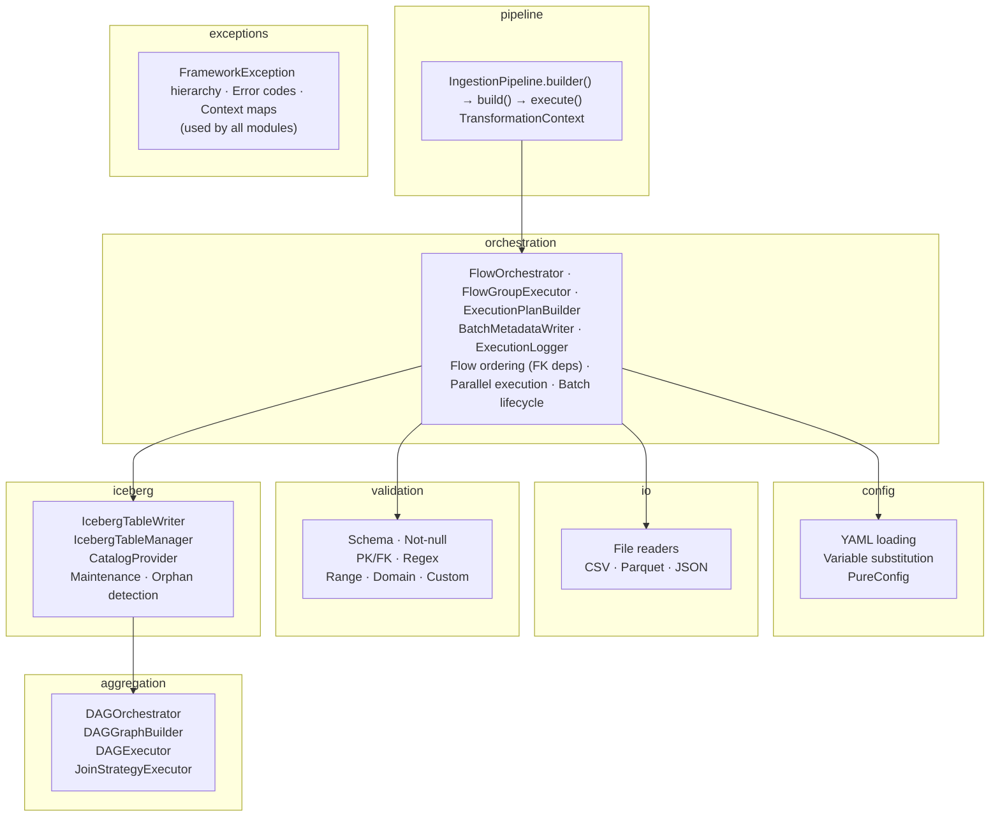

# Architecture Overview

High-level architecture of the Spark ETL Framework: how modules interact, the end-to-end data flow, and the design principles behind the system.

## Module diagram



## End-to-end data flow

A batch execution follows this sequence:

```
1. Configuration loading
   config/ → GlobalConfig + DomainsConfig + Seq[FlowConfig]

2. Pipeline build
   Validate configs → Configure Iceberg catalog → Register transformations

3. Flow ordering
   Analyze FK dependencies → Topological sort → Group independent flows

4. Flow execution (per flow, in dependency order)
   Read → PreTransform → Validate → PostTransform → Write (MERGE INTO)

5. Post-batch
   Orphan detection → Batch metadata write → Table maintenance

6. DAG aggregation (if configured)
   Load DAG config → Resolve dependencies → Execute nodes → Produce output
```

## Design principles

- **YAML-first**: pipeline behavior is defined declaratively. Code is only needed for transformations and custom validators.
- **Iceberg-required**: all writes go through Iceberg for ACID guarantees, time travel, and schema evolution. There is no Parquet fallback.
- **Fail-fast**: configuration errors are caught at startup, not at runtime. Missing fields, invalid references, and type mismatches all fail before any data is processed.
- **Immutable context**: `TransformationContext` is immutable. Every modification returns a new instance, preventing side effects between transformations.
- **Bounded parallelism**: parallel execution uses explicitly sized thread pools, never the global execution context.
- **Best-effort maintenance**: table maintenance (compaction, snapshot expiration) runs after writes but does not block batch success.

## Module interactions

| From | To | Interaction |
|------|----|-------------|
| `pipeline` | `config` | Loads YAML configuration |
| `pipeline` | `orchestration` | Delegates batch execution |
| `orchestration` | `io` | Reads source data |
| `orchestration` | `validation` | Validates DataFrames |
| `orchestration` | `iceberg` | Writes to Iceberg tables |
| `orchestration` | `aggregation` | Runs DAG after batch |
| `iceberg` | `config` | Reads Iceberg and output config |
| `validation` | `config` | Reads validation rules and domains |
| `aggregation` | `config` | Reads DAG YAML |
| All modules | `exceptions` | Throw typed exceptions |

## Related

- [Modules](modules.md) — detailed module responsibilities
- [Data Flow](data-flow.md) — step-by-step pipeline
- [Execution Model](execution-model.md) — flow ordering and parallelism
- [Design Decisions](design-decisions.md) — why Iceberg, why MERGE INTO
