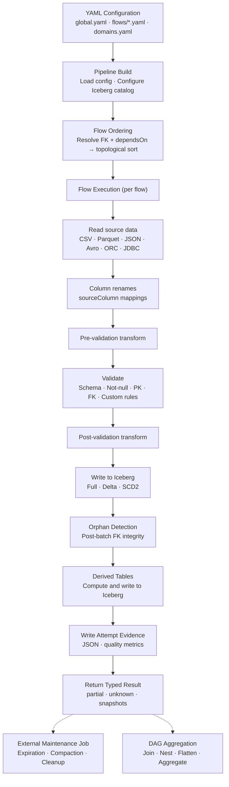

# Architecture Overview

High-level architecture of Floe: how the pipeline works, the end-to-end data flow, and the design principles behind the system.

## Pipeline flow


```mermaid
graph TD
    YAML["YAML Configuration<br/>global.yaml · flows/*.yaml · domains.yaml"]
    BUILD["Pipeline Build<br/>Load config · Configure Iceberg catalog"]
    ORDER["Flow Ordering<br/>Resolve FK + dependsOn → topological sort"]
    EXEC["Flow Execution (per flow)"]
    READ["Read source data<br/>CSV · Parquet · JSON · Avro · ORC · JDBC"]
    RENAME["Column renames<br/>sourceColumn mappings"]
    PRE["Pre-validation transform"]
    VAL["Validate<br/>Schema · Not-null · PK · FK · Custom rules"]
    POST["Post-validation transform"]
    WRITE["Write to Iceberg<br/>Full · Delta · SCD2"]
    ORPHAN["Orphan Detection<br/>Post-batch FK integrity"]
    DERIVED["Derived Tables<br/>Compute and write to Iceberg"]
    DIAG["Write Attempt Evidence<br/>JSON · quality metrics"]
    RESULT["Return Typed Result<br/>partial · unknown · snapshots"]
    WORKER["External Maintenance Job<br/>Expiration · Compaction · Cleanup"]
    DAG["DAG Aggregation<br/>Join · Nest · Flatten · Aggregate"]

    YAML --> BUILD --> ORDER --> EXEC
    EXEC --> READ --> RENAME --> PRE --> VAL --> POST --> WRITE
    WRITE --> ORPHAN --> DERIVED --> DIAG --> RESULT
    RESULT -.-> WORKER
    RESULT -.-> DAG
```

## End-to-end data flow

A batch execution follows this sequence:

```
1. Configuration loading
   config/ → GlobalConfig + DomainsConfig + Seq[FlowConfig]

2. Pipeline build
   Validate configs → Configure Iceberg catalog → Register transformations

3. Flow ordering
   Analyze FK and dependsOn → Topological sort → Group independent flows

4. Flow execution (per flow, in dependency order)
   Read → Rename columns → Pre-transform → Validate → Post-transform → Write to Iceberg

5. Correctness and derived outputs
   Orphan detection → Resolve declared attempt-pinned inputs → Topologically compute/write derived tables

6. Finalization
   Diagnostic metadata → Typed attempt result with per-target snapshot evidence

7. DAG aggregation (if configured, separate execution)
   Load DAG config → Resolve join dependencies → Execute nodes → Produce output

8. Maintenance (separately scheduled job)
   Platform selects tables → Expire snapshots → Compact data files → Remove old orphan files → Rewrite manifests
```

## Design principles

- **YAML-first**: pipeline behavior is defined declaratively. Code is only needed for transformations, custom validators, and derived tables.
- **Iceberg-required**: every managed flow and derived target is written through Iceberg for per-table ACID guarantees, time travel, and schema evolution.
- **Fail-fast**: configuration errors are caught at startup, not at runtime. Missing fields, invalid references, and type mismatches all fail before any data is processed.
- **Immutable context**: `TransformationContext` is immutable. Every modification returns a new instance, preventing side effects between transformations.
- **Bounded parallelism**: parallel execution uses explicitly sized thread pools, never the global execution context.
- **Orchestrator-neutral**: Floe has no workflow database; the platform owns scheduling, serialization, and request retention.
- **Explicit evidence**: typed data outcomes and pinned dependency snapshots expose partial and uncertain execution honestly.
- **Independent maintenance**: ingestion never queues or retries maintenance; schedule it as a separate operational workload.

## Modules

| Module | Responsibility |
|--------|---------------|
| `config` | YAML config loading, variable substitution, validation |
| `validation` | Validation engine: schema, not-null, PK, FK, regex, range, domain, custom |
| `iceberg` | Iceberg table writes (full/delta/SCD2), catalog management, maintenance |
| `io` | Data readers: CSV, Parquet, JSON, Avro, ORC, JDBC, custom |
| `aggregation` | DAG execution: join strategies, topological ordering, parallel groups |
| `orchestration` | Flow and batch orchestration, metadata, logging |
| `pipeline` | Public entry point: builder API, derived tables |
| `exceptions` | Typed exception hierarchy with error codes |

## Related

- [Data Flow](data-flow.md) — step-by-step pipeline with DataFrame transformations
- [Execution Model](execution-model.md) — flow ordering and parallelism
- [Design Decisions](design-decisions.md) — why Iceberg, why MERGE INTO
