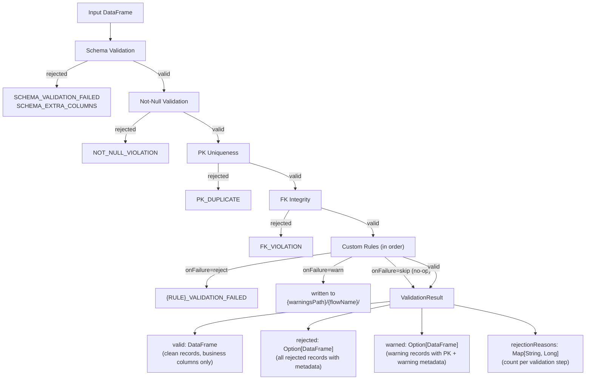

# Validation Engine

## Overview

The validation engine runs on every incoming DataFrame before it reaches the Iceberg write phase. It enforces data quality through a fixed pipeline of validation steps, each delegated to a specialized validator. Records that fail validation are separated into a rejected DataFrame with metadata columns explaining the failure.

The pipeline order is deterministic:

1. **Schema validation** — required columns present, no unexpected extras
2. **Not-null validation** — non-nullable columns contain no NULLs
3. **Primary key uniqueness** — PK columns have no duplicates
4. **Foreign key integrity** — FK values exist in referenced parent flows
5. **Custom rules** — regex, range, domain, and user-defined validators

Each step receives the valid records from the previous step. Rejected records accumulate across steps and are written to the configured `rejectedPath` at the end of the pipeline.


## Validation configuration

Validation is configured per-flow in the `validation` section of the flow YAML:

```yaml
validation:
  primaryKey: [order_id]
  foreignKeys:
    - columns: [customer_id]
      references:
        flow: customers
        columns: [customer_id]
      onOrphan: warn
  rules:
    - type: regex
      column: email
      pattern: "^[a-zA-Z0-9._%+\\-]+@[a-zA-Z0-9.\\-]+\\.[a-zA-Z]{2,}$"
      onFailure: reject
    - type: range
      column: total_amount
      min: "0.01"
      max: "999999.99"
      onFailure: warn
    - type: domain
      column: status
      domainName: order_status
      onFailure: reject
```

### Validation rule reference

Every rule in the `rules` list has this structure:

| Field | Type | Required | Default | Description |
|-------|------|----------|---------|-------------|
| `type` | string | yes | — | Rule type: `regex`, `range`, `domain`, `custom` |
| `column` | string | conditional | — | Column to validate. Required for `regex`, `range`, `domain`. Optional for `custom` (custom validators can do cross-column validation). |
| `pattern` | string | — | — | Regex pattern (required for `regex` type) |
| `min` | string | — | — | Minimum value (for `range` type, at least one of min/max required) |
| `max` | string | — | — | Maximum value (for `range` type) |
| `domainName` | string | — | — | Domain name from `domains.yaml` (required for `domain` type) |
| `class` | string | — | — | Validator name (registered via builder) or fully qualified class name (required for `custom` type) |
| `config` | map | — | — | Key-value config passed to custom validators |
| `description` | string | — | — | Human-readable description (used in warning messages) |
| `skipNull` | boolean | — | `true` | If true, NULL values pass validation without being checked |
| `onFailure` | string | — | `reject` | Action on failure: `reject`, `warn`, or `skip` |

## Batch-level rejection behavior

One setting in `global.yaml` controls what happens when records are rejected:

```yaml
processing:
  maxRejectionRate: 0.05
```

| Setting | Default | Description |
|---------|---------|-------------|
| `maxRejectionRate` | — (disabled) | Rejection rate threshold (0.05 = 5%). If set, the batch stops when any flow exceeds this rate. If omitted, the batch never stops for rejected records. |

| `maxRejectionRate` | Rejection rate vs threshold | Behavior |
|-------------------|---------------------------|----------|
| not set | any | Batch continues. Rejected records are written to `rejectedPath`, valid records proceed to Iceberg. |
| set | `rate > maxRejectionRate` | Batch stops. Remaining flows in the group are not executed. |
| set | `rate <= maxRejectionRate` | Batch continues. |

The comparison uses strict `>` (not `>=`): a rejection rate exactly equal to the threshold does not trigger a stop.

## Schema validation

When `schema.enforceSchema` is `true`, the validator checks two things:

1. All columns defined in `schema.columns` must be present in the DataFrame. If any are missing, the **entire DataFrame is rejected** with code `SCHEMA_VALIDATION_FAILED`. No valid records survive — this is a fatal schema mismatch.

2. If `schema.allowExtraColumns` is `false`, columns present in the DataFrame but not defined in `schema.columns` are flagged. Internal columns (prefixed with `_`) are excluded from this check. Same behavior: the entire DataFrame is rejected with code `SCHEMA_EXTRA_COLUMNS`.

```yaml
schema:
  enforceSchema: true
  allowExtraColumns: false
  columns:
    - name: order_id
      type: integer
      nullable: false
    - name: status
      type: string
      nullable: true
```

If `enforceSchema` is `false`, schema validation is skipped entirely.

## Not-null validation

Checks every column where `nullable: false` in the schema definition. Any row with a NULL in a non-nullable column is rejected with code `NOT_NULL_VIOLATION`.

The check is derived from the schema config — there is no separate YAML section for not-null rules. Setting `nullable: false` on a column is sufficient.

## Primary key uniqueness

The `primaryKey` field defines one or more columns that must be unique across the DataFrame. Composite keys are supported:

```yaml
validation:
  primaryKey: [order_id, line_item_id]
```

Duplicate detection uses `groupBy` + `count > 1`. All rows sharing a duplicated key combination are rejected — not just the second occurrence, but every row with that key value. Rejection code: `PK_DUPLICATE`.

!!!note
    A primary key is required for `delta` and `scd2` load modes. For `full` load mode, if `primaryKey` is empty, PK uniqueness validation is skipped.

## Foreign key integrity

Foreign keys validate that values in a child flow's columns exist in a parent flow's columns. The framework automatically executes parent flows before children based on FK dependencies, so the parent data is always available when the child is validated.

```yaml
foreignKeys:
  - columns: [customer_id]
    references:
      flow: customers
      columns: [customer_id]
    onOrphan: warn
```

### FK configuration reference

| Field | Type | Required | Default | Description |
|-------|------|----------|---------|-------------|
| `columns` | list | yes | — | Column(s) in the current flow. Use a list for composite FKs. |
| `references.flow` | string | yes | — | Name of the parent flow |
| `references.columns` | list | yes | — | Column(s) in the parent flow (same order as `columns`) |
| `onOrphan` | string | — | `warn` | Post-batch orphan action: `warn`, `delete`, `ignore` |

Composite FK example:

```yaml
foreignKeys:
  - columns: [order_id, line_item_id]
    references:
      flow: order_items
      columns: [order_id, line_item_id]
    onOrphan: warn
```

### Behavior

- NULL FK values are not considered violations. A NULL means "no reference" (standard SQL semantics) and passes FK validation.
- The referenced parent DataFrame is broadcast-joined for performance. Multiple FK constraints referencing the same parent flow/columns share a single broadcast.
- If the referenced flow name does not exist in the batch configuration, a `ValidationConfigException` is thrown at startup.
- Rejection code: `FK_VIOLATION`.

The `onOrphan` field does not affect intra-batch validation — it controls post-batch orphan detection behavior. See [Orphan Detection](orphan-detection.md).

## Custom rules

Custom rules are defined in the `rules` list and processed in order. Each rule is dispatched to a specialized validator based on its `type`.

### Regex validation

Validates that column values match a regular expression pattern.

```yaml
- type: regex
  column: email
  pattern: "^[a-zA-Z0-9._%+\\-]+@[a-zA-Z0-9.\\-]+\\.[a-zA-Z]{2,}$"
  onFailure: reject
```

The pattern is validated at configuration time — an invalid regex throws `ValidationConfigException` before any data is processed. Rejection code: `REGEX_VALIDATION_FAILED`.

### Range validation

Validates that numeric column values fall within a specified range. At least one of `min` or `max` is required.

```yaml
- type: range
  column: total_amount
  min: "0.01"
  max: "999999.99"
  onFailure: reject
```

Values are compared numerically (cast to `DoubleType`), not lexicographically. This means string columns containing numbers are handled correctly — `"9"` is not considered greater than `"10"`.

If `min > max`, a `ValidationConfigException` is thrown. Rejection code: `RANGE_VALIDATION_FAILED`.

### Domain validation

Validates that column values belong to a predefined set of allowed values. Domains are defined in `domains.yaml`:

```yaml
# domains.yaml
domains:
  order_status:
    name: order_status
    description: "Valid order statuses"
    values: ["pending", "confirmed", "shipped", "delivered", "cancelled"]
    caseSensitive: false
```

Referenced in the flow YAML:

```yaml
- type: domain
  column: status
  domainName: order_status
  onFailure: reject
```

| Domain field | Default | Description |
|-------------|---------|-------------|
| `name` | — | Domain identifier |
| `description` | — | Human-readable description |
| `values` | — | List of allowed values |
| `caseSensitive` | `true` | If false, comparison is case-insensitive |

If the domain name is not found in `domains.yaml`, the framework throws a `ValidationConfigException` at runtime. Rejection code: `DOMAIN_VALIDATION_FAILED`.

For domain configuration details, see [Domains Configuration](../configuration/domains.md).

### Custom class validation

For validation logic that cannot be expressed with regex, range, or domain rules, provide a custom validator class. There are two ways to wire it up:

1. **Registry (recommended)** — register the validator by name on the pipeline builder, then reference that name in YAML:

```scala
IngestionPipeline.builder()
  .withConfigDirectory("config")
  .withCustomValidator("luhn", () => new LuhnCheckValidator())
  .build()
```

```yaml
- type: custom
  class: luhn
  column: credit_card_number
  config:
    strict: "true"
  onFailure: reject
```

2. **Reflection** — use the fully qualified class name directly in YAML (the framework loads it via `Class.forName`):

```yaml
- type: custom
  class: "com.mycompany.validators.LuhnCheckValidator"
  column: credit_card_number
  config:
    strict: "true"
  onFailure: reject
```

The registry has priority: if the `class` value matches a registered name, the registry is used; otherwise it falls back to reflection.

The validator class must:

1. Have a no-argument constructor
2. Implement the `com.etl.framework.validation.Validator` trait

Configuration from the YAML `config` map is available via `rule.config` inside the `validate` method:

```scala
import com.etl.framework.validation.{Validator, ValidationStepResult}
import com.etl.framework.config.ValidationRule
import org.apache.spark.sql.DataFrame

class LuhnCheckValidator extends Validator {
  override def validate(df: DataFrame, rule: ValidationRule): ValidationStepResult = {
    val strict = rule.config.flatMap(_.get("strict")).contains("true")
    // Custom validation logic here
    // Return ValidationStepResult(validDf, Some(rejectedDf)) or
    // ValidationStepResult(validDf, None) if all records pass
    ???
  }
}
```

For a detailed guide on writing custom validators, see [Custom Validators](custom-validators.md).

## skipNull behavior

The `skipNull` property controls how NULL values are treated during rule validation. It defaults to `true`.

| `skipNull` | Behavior |
|-----------|----------|
| `true` (default) | NULL values pass validation. Only non-NULL values are checked against the rule. |
| `false` | NULL values are treated as validation failures and rejected/warned. |

This applies to regex, range, domain, and custom rules. Schema validation and not-null validation have their own NULL handling (not-null explicitly checks for NULLs; schema validation does not inspect values).

Example: a regex rule with `skipNull: false` rejects rows where the column is NULL, even though NULL cannot match any pattern.

```yaml
- type: regex
  column: phone
  pattern: "^\\+?[0-9]{10,15}$"
  skipNull: false
  onFailure: reject
```

## onFailure behavior

Each rule has an `onFailure` property that determines what happens when a record fails validation.

### reject (default)

The record is removed from the valid DataFrame and added to the rejected DataFrame with metadata columns:

| Column | Description |
|--------|-------------|
| `_rejection_code` | Machine-readable code (e.g. `REGEX_VALIDATION_FAILED`) |
| `_rejection_reason` | Human-readable explanation |
| `_validation_step` | Which validation step rejected the record |
| `_rejected_at` | Timestamp of the validation step execution |
| `_batch_id` | Batch identifier |

Rejected records are written to the flow's `rejectedPath`.

### warn

The record stays in the valid DataFrame unchanged (no extra columns are added). A separate warning record is written to a Parquet file at `{warningsPath}/{flowName}/` (defaults to `{outputPath}/warnings/{flowName}/` if `warningsPath` is not configured in `global.yaml`). Each warning record contains the flow's primary key columns plus warning metadata:

| Column | Description |
|--------|-------------|
| `_warning_rule` | Name of the rule that triggered the warning |
| `_warning_message` | Human-readable message (from the rule's `description`, or auto-generated) |
| `_warning_column` | Column that was validated |
| `_warned_at` | Timestamp of the warning |
| `_batch_id` | Batch identifier |

```yaml
- type: range
  column: age
  min: "0"
  max: "150"
  description: "Age outside expected range"
  onFailure: warn
```

The Iceberg table contains only business columns — no internal framework columns are written.

### skip

The rule is not executed at all. Useful for temporarily disabling a rule without removing it from the config.

## Validation pipeline data flow



## Complete flow example

```yaml
name: orders
description: "Customer orders with full validation"
version: "1.0"
owner: data-team

source:
  type: file
  path: "data/orders.csv"
  format: csv
  options:
    header: "true"

schema:
  enforceSchema: true
  allowExtraColumns: false
  columns:
    - name: order_id
      type: integer
      nullable: false
    - name: customer_id
      type: integer
      nullable: false
    - name: email
      type: string
      nullable: true
    - name: status
      type: string
      nullable: false
    - name: total_amount
      type: double
      nullable: false
    - name: order_date
      type: date
      nullable: false

loadMode:
  type: delta

validation:
  primaryKey: [order_id]
  foreignKeys:
    - columns: [customer_id]
      references:
        flow: customers
        columns: [customer_id]
      onOrphan: warn
  rules:
    - type: regex
      column: email
      pattern: "^[a-zA-Z0-9._%+\\-]+@[a-zA-Z0-9.\\-]+\\.[a-zA-Z]{2,}$"
      skipNull: true
      onFailure: reject
    - type: domain
      column: status
      domainName: order_status
      onFailure: reject
    - type: range
      column: total_amount
      min: "0.01"
      onFailure: reject
      description: "Order total must be positive"
    - type: range
      column: total_amount
      max: "100000"
      onFailure: warn
      description: "Unusually high order total"

output:
  icebergPartitions:
    - "month(order_date)"
```

In this example:

- Schema enforcement rejects rows with missing or extra columns
- Not-null rejects rows where `order_id`, `customer_id`, `status`, `total_amount`, or `order_date` is NULL
- PK uniqueness rejects all rows sharing a duplicate `order_id`
- FK integrity rejects rows where `customer_id` does not exist in the `customers` flow
- Regex rejects rows with invalid email format (NULLs pass because `skipNull` defaults to `true`)
- Domain rejects rows with invalid `status` values
- First range rule rejects orders with `total_amount < 0.01`
- Second range rule warns (but keeps) orders with `total_amount > 100000`

## Related

- [Flow Configuration](../configuration/flows.md) — flow YAML reference
- [Domains Configuration](../configuration/domains.md) — domain definitions
- [Custom Validators](custom-validators.md) — writing your own validators
- [Orphan Detection](orphan-detection.md) — post-batch FK integrity
- [Global Configuration](../configuration/global.md) — rejection behavior settings
